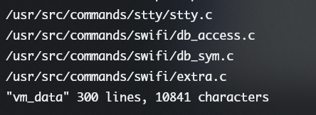

# VE482 — Introduction to Operating Systems Lab 8

**Group-pair 8**: 518370910200 Shengyuan Xu, 518370910216 Xiangjie Li

[TOC]

## 2 Memory in Minix 3

### 2.1 Memory management at kernel level

- **What does `vm  `stands for? (Hint: in this context the answer is not virtual machine)**

  Virtual memory.

  

- **Find the page table definition and search what fields each entry contain?**

  A page table is the data structure used by a virtual memory system in a computer operating system to store the mapping between virtual addresses and physical addresses.

  Each page table entry (PTE) holds the mapping between a virtual address of a page and the address of a physical frame. There is also auxiliary information about the page such as a present bit, a dirty or modified bit, address space or process ID information, amongst others.

  

- **What basic functions are used to handle virtual memory?**

  - The **VirtualAlloc** function performs one of the following operations:

    - Reserves one or more free pages.
    - Commits one or more reserved pages.
    - Reserves and commits one or more free pages.

    ```c++
    LPVOID VirtualAlloc(
      [in, optional] LPVOID lpAddress,
      [in]           SIZE_T dwSize,
      [in]           DWORD  flAllocationType,
      [in]           DWORD  flProtect
    );
    ```

    

  - The **VirtualFree** function decommits and releases pages according to the following rules:

    - Decommits one or more committed pages, changing the state of the pages to reserved. Decommitting pages releases the physical storage associated with the pages, making it available to be allocated by any process. Any block of committed pages can be decommitted.
    - Releases a block of one or more reserved pages, changing the state of the pages to free. Releasing a block of pages makes the range of reserved addresses available to be allocated by the process. Reserved pages can be released only by freeing the entire block that was initially reserved by **VirtualAlloc**.
    - Decommits and releases a block of one or more committed pages simultaneously, changing the state of the pages to free. The specified block must include the entire block initially reserved by **VirtualAlloc**, and all of the pages must be currently committed.

    ```c++
    BOOL VirtualFree(
      [in] LPVOID lpAddress,
      [in] SIZE_T dwSize,
      [in] DWORD  dwFreeType
    );
    ```

    

  - The **VirtualQuery** and **VirtualQueryEx** functions return information about a region of consecutive pages beginning at a specified address in the address space of a process. **VirtualQuery** returns information about memory in the calling process. **VirtualQueryEx** returns information about memory in a specified process and is used to support debuggers that need information about a process being debugged. The region of pages is bounded by the specified address rounded down to the nearest page boundary. It extends through all subsequent pages with the following attributes in common:
  
    - The state of all pages is the same: either committed, reserved, or free.
    - If the initial page is not free, all pages in the region are part of the same initial allocation of pages that were reserved by a call to **VirtualAlloc**.
    - The access protection of all pages is the same (that is, **PAGE_READONLY**, **PAGE_READWRITE**, or **PAGE_NOACCESS**).
  
    ```c++
    SIZE_T VirtualQuery(
      [in, optional] LPCVOID                   lpAddress,
      [out]          PMEMORY_BASIC_INFORMATION lpBuffer,
      [in]           SIZE_T                    dwLength
    );
    
    SIZE_T VirtualQueryEx(
      [in]           HANDLE                    hProcess,
      [in, optional] LPCVOID                   lpAddress,
      [out]          PMEMORY_BASIC_INFORMATION lpBuffer,
      [in]           SIZE_T                    dwLength
    );
    ```
  
    
  
  - The **VirtualLock** function enables a process to lock one or more pages of committed memory into physical memory (RAM), preventing the system from swapping the pages out to the paging file. It can be used to ensure that critical data is accessible without disk access. Locking pages into memory is dangerous because it restricts the system's ability to manage memory. Excessive use of **VirtualLock** can degrade system performance by causing executable code to be swapped out to the paging file. The **VirtualUnlock** function unlocks memory locked by **VirtualLock**.
  
    ```c++
    BOOL VirtualLock(
      [in] LPVOID lpAddress,
      [in] SIZE_T dwSize
    );
    ```
    
    
    
  - The **VirtualProtect** function enables a process to modify the access protection of any committed page in the address space of a process. For example, a process can allocate read/write pages to store sensitive data, and then it can change the access to read only or no access to protect against accidental overwriting. **VirtualProtect** is typically used with pages allocated by **VirtualAlloc**, but it also works with pages committed by any of the other allocation functions. However, **VirtualProtect** changes the protection of entire pages, and pointers returned by the other functions are not necessarily aligned on page boundaries. The **VirtualProtectEx** function is similar to **VirtualProtect**, except it changes the protection of memory in a specified process. Changing the protection is useful to debuggers in accessing the memory of a process being debugged.
  
     ```c++
     BOOL VirtualProtect(
       [in]  LPVOID lpAddress,
       [in]  SIZE_T dwSize,
       [in]  DWORD  flNewProtect,
       [out] PDWORD lpflOldProtect
     );
     ```
  
  
  
- **Find all the places where the `vm` used inside the kernel, Why does it appear in so many different places?**

  - `find /usr/src -name "*.c" | xargs grep -l "vm" > vm_data`
  - 
  - There're 300 source files contain vm.
  - The reason why `vm` is used in so many different places is that we don't have enough RAM for all the processes, but they all need memory to be executed. Virtual memory mechnism make the processes believe they have a continuous range of RAM. This makes programming easier, we can always assume the system can provide enough memory.

  

- **How is memory allocated within the kernel? Why are not `malloc` and `calloc` used?**

  - ```c++
    // Memory allocation function which allocates size_t bytes according to the flags provided. Usually used for memory allocation sizes up to a PAGE size of memory.
    void *kmalloc(size_t size, gfp_t flags)
    
    // allocate virtually contiguous memory
    void * vmalloc(unsigned long size)
    ```

  - Functions used in the kernel should be defined in the kernel. `malloc` and `calloc` are library functions defined in user space, therefore, they cannot be used.

    

- **While allocating memory, how does the functions in kernel space switch back and froth between user and kernel spaces? How is that boundary crossed? How good or bad it is to put vm in userspace?**
  
  - When the user calls the function, e.g. `malloc` or `calloc`, take Minix3 as an example, the kernel calls the following functions one by one:
  
    1. `mmap()`
    2. `do_mmap()`
    3. `map_page_region()`
    4. `map_ph_writept()`
    5. `pt_writemap()`
  
    General idea is to ask the memory management unit for a block of memory, next establish a map connection of that block, then write that part onto the page table, finally return the pointer to the userspace, who can use it to have access to the memory block.
  
  - By mapping user-space memory into the kernel (with get_user_pages).
  
  - It depends. It's good for our usual PC, since it can prevent the user from changing the memory intentionally or accidently, thus protecting our computer. However, for real-time system or embedded system, the kernel is designed to serve, and two separate space (userspace and kernel-space are unnecessary).
  
    
  
- **How are pagefaults handled?**

  1. Check the location of the referenced page in the PMT
  2. If a page fault occured, call on the operating system to fix it
  3. Using the frame replacement algorithm, find the frame location
  4. Read the data from disk to memory
  5. Update the page map table for the process
  6. The instruction that caused the page fault is restarted when the process resumes execution.


### 2.2 Mum's Really Unfair

- **What algorithm is used by default in Minix 3 to handle pagefault? Find its implementation and study it closely.**

  In `/servers/vm/pagefaults.c`, we can find how Minix 3 handle pagefault. 

  ```c
  char *pf_errstr(u32_t err) // generate the error information
  void do_pagefaults(message *m) 
  void do_memory(void)
  int handle_memory(struct vmproc *vmp, vir_bytes mem, vir_bytes len, int wrflag)
  ```

  


- **Use the top command to keep track of your used memory and cache, then run `time grep -r "mum" /usr/src`. Run the command again. What do you notice?**

  - The command search fot the pattern "mum" in Minix source code.
  - I conduct 3 trials, the results are as follows
  
  | trial | real  | user | sys  |
  | ----- | ----- | ---- | ---- |
  | 1     | 14.98 | 0.13 | 8.06 |
  |2			|2.76|0.50|1.51|
  |3	|2.70|0.70|1.56|
  
  - Basing on the test result, we can conclude that the searching process in the first trial is put in the memory. Since I don't other commands to drop it out of the memory, it is kept there. During the following calls of this command, the result returns much faster than the first trial.


- **Adjust the implementation of LRU into MRU and recompile the kernel.**


- **Use the top command to keep track of your used memory and cache, then run `time grep -r "mum" /usr/src`. Run the command again. What do you notice?**

  | l    | real | user | sys  |
  | ---- | ---- | ---- | ---- |
  | 1    |      |      |      |
  | 2    |      |      |      |
  | 3    |      |      |      |

​	

- **Discuss the different behaviours of LRU and MRU as well as the consequences for the users. Can**

  **you think of any situation where MRU would be better than LRU?**


## Reference 

[1] https://docs.microsoft.com/en-us/windows/win32/memory/virtual-memory-functions
